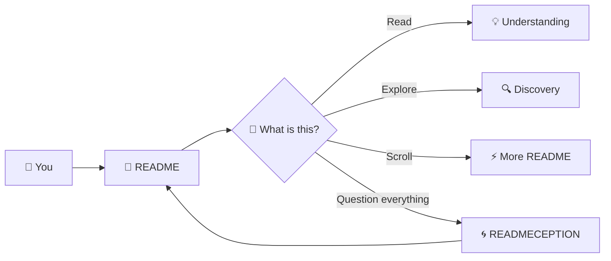
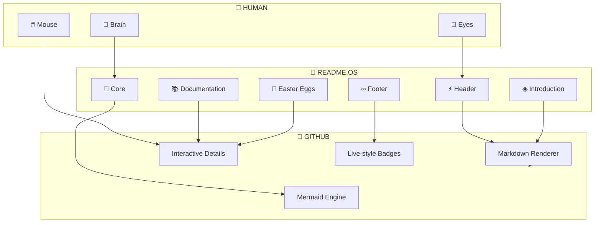
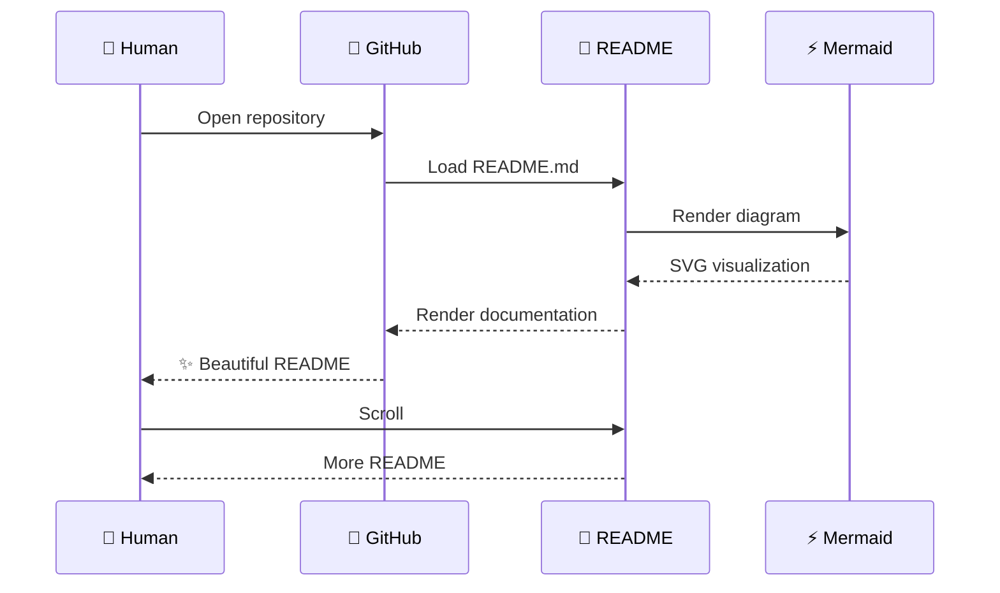
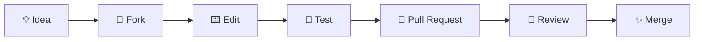

<div align="center">

# ⚡ README.OS

### The README that refuses to be boring.


<br>

[](#)
[](#)
[](#)
[](#)

<br>

> **A repository about a repository.**
> A README about a README.
> Documentation documenting documentation.

<br>

**[ EXPLORE ] · [ UNDERSTAND ] · [ BREAK ] · [ REBUILD ]**

</div>

---

## ◈ SYSTEM BOOT

```text
╭──────────────────────────────────────────────────────────────╮
│                      README.OS v∞                            │
├──────────────────────────────────────────────────────────────┤
│                                                              │
│  [✓] Kernel ................. ONLINE                         │
│  [✓] Documentation .......... LOADED                         │
│  [✓] Creativity ............. UNLIMITED                      │
│  [✓] Boredom ................ TERMINATED                     │
│  [✓] Coffee ................. OPTIONAL                       │
│                                                              │
│  SYSTEM MESSAGE                                               │
│  ─────────────                                               │
│  This README is fully aware that it is a README.             │
│                                                              │
╰──────────────────────────────────────────────────────────────╯
```

---

## ◉ WHAT IS THIS?

This repository contains **itself**.

Not a library.

Not an API.

Not another TODO app.

This is an experiment in pushing a GitHub README as far as possible without turning it into an actual website.

The documentation **is the product**.

The interface **is the documentation**.

And the README you're currently reading is the entire point.

---

## ⚡ THE CORE IDEA



> **You have entered the documentation loop.**

---

# 🧬 DNA

| Component           | Purpose                      | Status     |
| ------------------- | ---------------------------- | ---------- |
| 📝 Markdown         | The foundation               | `100%`     |
| 🎨 Design           | Make documentation beautiful | `ACTIVE`   |
| ⚡ Animation         | Make static text feel alive  | `ACTIVE`   |
| 🧠 Self-awareness   | Explain itself               | `MAXIMUM`  |
| 🧩 Interaction      | Let you control what you see | `ENABLED`  |
| 🌀 Recursion        | README explaining README     | `∞`        |
| ☕ Coffee dependency | Technically unnecessary      | `OPTIONAL` |

---

## 🛰️ ARCHITECTURE



---

# 🚀 FEATURES

### `01` — SELF-AWARE

This README knows what it is.

It knows where it lives.

It knows you're reading it.

That's probably enough awareness for one Markdown file.

---

### `02` — ZERO SETUP

```bash
git clone <this-repository>
cd <this-repository>
cat README.md
```

That's it.

No installation.

No dependencies.

No environment variables.

No Kubernetes cluster.

Just Markdown.

---

### `03` — INTERACTIVE SECTIONS

<details>
<summary>▶ Click me — something is hiding here</summary>

You found the first interactive layer.

GitHub supports native collapsible `<details>` sections, so this README can actually respond to clicks without JavaScript.

**Congratulations.**

You interacted with Markdown.

</details>

<details>
<summary>▶ Click me — classified information</summary>

```text
ACCESS LEVEL: README

SECRET:
There is no secret.

You just spent time looking for one.

:)
```

</details>

<details>
<summary>▶ Click me — definitely important</summary>

████████████████████████████████████████

**██████████████████████████████████████**

████████████████████████████████████████

> This information has been classified as:
> **EXTREMELY README**

</details>

---

# 🎛️ CONTROL PANEL

```text
╭────────────────────────────────────────╮
│             README CONTROL              │
├────────────────────────────────────────┤
│                                        │
│  POWER       ██████████████████ 100%   │
│  STYLE       ██████████████████ 100%   │
│  CHAOS       ███████████████░░░  87%   │
│  USEFULNESS  █████████████████░  94%   │
│  CONFUSION   ██████████████████ 100%   │
│                                        │
│  MODE:     DOCUMENTATION               │
│  ENGINE:   MARKDOWN                    │
│  ENERGY:   UNREASONABLE                │
│                                        │
╰────────────────────────────────────────╯
```

---

# 📡 LIVE SYSTEM

```text
╭───────────────────────────────────────────────╮
│                 SYSTEM MONITOR                │
├───────────────────────────────────────────────┤
│                                               │
│  README       ● ONLINE                        │
│  GITHUB       ● ONLINE                        │
│  MERMAID      ● ONLINE                        │
│  MARKDOWN     ● ONLINE                        │
│  IMAGINATION  ● OVERCLOCKED                   │
│                                               │
│  UPTIME       █████████████████████████  ∞    │
│  VERSION      v∞                              │
│  LATENCY      ~0 ms                           │
│                                               │
╰───────────────────────────────────────────────╯
```

---

# 🧠 HOW IT WORKS

The entire experience follows one extremely complicated architecture:



---

# 🧩 THE TECHNOLOGY

```text
Frontend
┌─────────────────────────────────────┐
│ Markdown                            │
│ HTML                                │
│ Mermaid                             │
│ SVG                                 │
│ Shields                             │
└─────────────────────────────────────┘

Backend
┌─────────────────────────────────────┐
│                                     │
│          There is no backend.       │
│                                     │
└─────────────────────────────────────┘

Infrastructure
┌─────────────────────────────────────┐
│ Git                                 │
│ GitHub                              │
│ Your browser                        │
└─────────────────────────────────────┘
```

---

# 📚 DOCUMENTATION

<details>
<summary>📖 What is README.md?</summary>

`README.md` is the front door of a repository.

It explains what something is, why it exists, how it works, and how someone can use it.

This README decided to take that concept slightly too seriously.

</details>

<details>
<summary>⚙️ Why Markdown?</summary>

Because Markdown is:

* Simple
* Portable
* Human-readable
* Developer-friendly
* Git-friendly
* Surprisingly powerful

And because this entire project would be considerably less impressive if it required 47 JavaScript packages.

</details>

<details>
<summary>🌀 Why does this repository exist?</summary>

To answer a very important question:

> **How far can you push a README before it starts feeling like an application?**

This repository is the experiment.

</details>

---

# 🥚 EASTER EGG PROTOCOL

<details>
<summary>🔐 LEVEL 01</summary>

You clicked something.

That means the system has detected curiosity.

**Curiosity level: +1**

</details>

<details>
<summary>🔐 LEVEL 02</summary>

The README is now aware that you have opened a hidden section.

It is becoming self-conscious.

</details>

<details>
<summary>🔐 LEVEL 03</summary>

```text
WARNING

Recursive documentation detected.

README
 ↓
README
 ↓
README
 ↓
README
 ↓
README
 ↓
README
 ↓
README
```

Abort mission.

</details>

---

# 🌌 THE PHILOSOPHY

Most READMEs answer:

> "What does this project do?"

This one asks:

> "What can a README become?"

A README can be:

* documentation
* an interface
* a visual identity
* a technical overview
* an onboarding experience
* a playground
* a tiny piece of art

The limitation isn't Markdown.

The limitation is imagination.

---

# 📊 PROJECT METRICS

```text
╭────────────────────────────────────────────╮
│              README ANALYTICS              │
├────────────────────────────────────────────┤
│                                            │
│  Lines of Markdown       ████████████  ∞   │
│  Dependencies            ░░░░░░░░░░░░  0   │
│  Backend servers         ░░░░░░░░░░░░  0   │
│  JavaScript frameworks   ░░░░░░░░░░░░  0   │
│  Self references         ████████████  ∞   │
│  Style                   ████████████  ∞   │
│  Seriousness             ███░░░░░░░░  24%  │
│  Chaos                   ███████████░  91%  │
│                                            │
╰────────────────────────────────────────────╯
```

---

# 🛠️ REPOSITORY STRUCTURE

```text
.
├── README.md
│   └── you are here
│
├── LICENSE
│
└── .github/
    └── workflows/
        └── ...
```

Yes.

The README is the main character.

---

# ⚡ PERFORMANCE

```text
Load time:
████████████████████████████████████████  instant*

Memory:
████████████████████████████████████████  tiny*

CPU:
████████████████████████████████████████  depends on GitHub

Dependencies:
0

Servers:
0

Drama:
∞
```

<sub>*Approximately. Please do not benchmark a Markdown file.</sub>

---

# 🤝 CONTRIBUTING

Want to improve the README?

Excellent.

The README welcomes:

```text
✓ Better visuals
✓ Better diagrams
✓ Better documentation
✓ Creative experiments
✓ Accessibility improvements
✓ New Easter eggs
✓ Ridiculous ideas
```

Avoid:

```text
✗ Making it boring
✗ Removing the chaos
✗ Adding unnecessary complexity
✗ Turning it into a 900 MB frontend
```

### Contribution flow



---

# 📜 LICENSE

This project is licensed under the **MIT License**.

Use it.

Modify it.

Break it.

Improve it.

Build something ridiculous with it.

---

# 💜 FINAL MESSAGE

<div align="center">

## You reached the bottom.

```text
There is nothing else here.

Probably.

```

### Unless...

<details>
<summary>👀 You REALLY want to keep going?</summary>

<br>

# READMECEPTION

You are reading a README.

Inside that README is a section explaining the README.

Inside that section is a README.

Inside that README is...

**No.**

We're stopping here.

</details>

<br>

---

### Built with

**Markdown · Git · GitHub · Mermaid · Imagination**

<br>

`README.OS`

**STATUS: STILL RUNNING**

<br>


</div>
