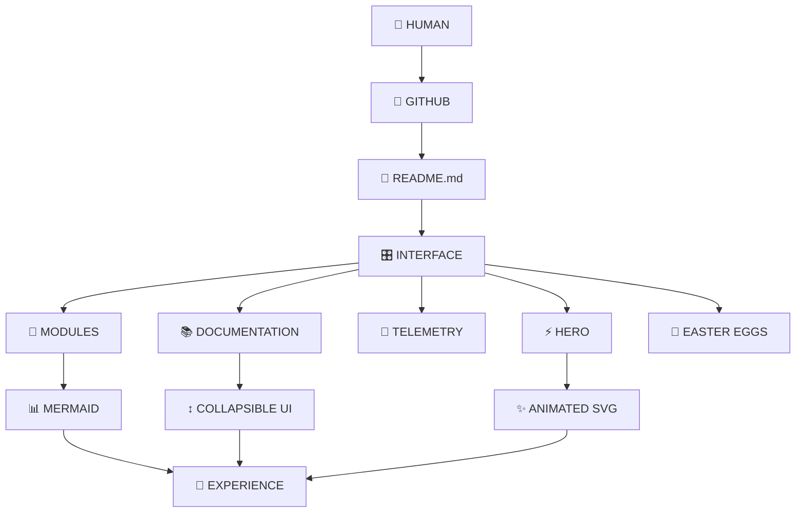
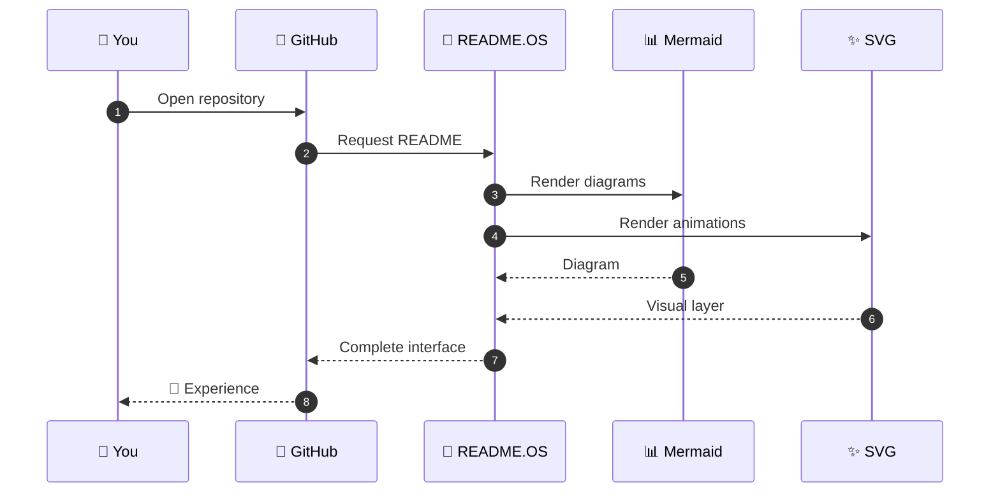

<div align="center">


<br>


<br><br>

[](#)
[](#)
[](#)
[](#)

<br>

### `A SELF-AWARE DOCUMENTATION INTERFACE`

[ **EXPLORE** ] · [ **ARCHITECTURE** ] · [ **SYSTEM** ] · [ **EASTER EGGS** ]

</div>

---

<div align="center">

```text
╔══════════════════════════════════════════════════════════════════════╗
║                         ◉ README.OS                                  ║
║                    DOCUMENTATION INTERFACE                           ║
╠══════════════════════════════════════════════════════════════════════╣
║                                                                      ║
║   STATUS        ████████████████████████████████  ONLINE             ║
║   CORE          ████████████████████████████████  STABLE             ║
║   CREATIVITY    ████████████████████████████████  OVERCLOCKED        ║
║   CHAOS         ███████████████████████████░░░░  91%                ║
║   BORING        ░░░░░░░░░░░░░░░░░░░░░░░░░░░░░░  0%                 ║
║                                                                      ║
║   ┌──────────────────────────────────────────────────────────────┐   ║
║   │  > README initialized                                       │   ║
║   │  > Interface rendered                                       │   ║
║   │  > Human detected                                           │   ║
║   │  > Curiosity detected                                       │   ║
║   │  > Welcome.                                                 │   ║
║   └──────────────────────────────────────────────────────────────┘   ║
║                                                                      ║
╚══════════════════════════════════════════════════════════════════════╝
```

</div>

# `01` — SYSTEM

> **README.OS is a README that treats documentation like a frontend.**

Most repositories give you:

```text
Title
↓
Description
↓
Installation
↓
Usage
↓
Done.
```

README.OS says:

```text
Repository
    ↓
Interface
    ↓
Experience
    ↓
Documentation
    ↓
Interaction
    ↓
✨
```

It isn't trying to replace a website.

It's exploring how far **GitHub-native Markdown can be pushed toward an interface**.

---

# `02` — EXPERIENCE

<div align="center">

### ✦ NOT A README.

### **A DOCUMENTATION INTERFACE.**

<br>

```text
┌───────────────┐
│   README.OS   │
├───────────────┤
│               │
│  SYSTEM       │
│  FEATURES     │
│  ARCHITECTURE │
│  TERMINAL     │
│  EASTER EGGS  │
│               │
└───────────────┘
       │
       ▼
   YOU ARE HERE
```

</div>

---

# `03` — CORE MODULES

<table>
<tr>
<td width="50%">

### ⚡ INTERFACE

A README designed like a product interface rather than a wall of text.

</td>

<td width="50%">

### 🧠 SELF-AWARE

The documentation explains the documentation.

</td>
</tr>

<tr>
<td>

### 🌀 RECURSION

A README documenting a README documenting...

</td>

<td>

### 🎛️ INTERACTION

Collapsible panels, diagrams, navigation and visual state.

</td>
</tr>

<tr>
<td>

### 🌌 VISUALS

Animated SVGs, terminal displays and futuristic UI elements.

</td>

<td>

### 🧩 ZERO DEPENDENCIES

The core experience requires nothing beyond Markdown rendering.

</td>
</tr>
</table>

---

# `04` — ARCHITECTURE



---

# `05` — LIVE TELEMETRY

<div align="center">

```text
┌───────────────────────────────────────────────────────────────┐
│                    SYSTEM TELEMETRY                           │
├───────────────────────────────────────────────────────────────┤
│                                                               │
│  CORE STATUS       ● ONLINE                                   │
│  DOCUMENTATION     ● LOADED                                   │
│  INTERFACE         ● ACTIVE                                   │
│  MERMAID           ● READY                                    │
│  ANIMATION         ● RUNNING                                  │
│                                                               │
│  CPU               ███████████████░░░░░  78%                 │
│  MEMORY            ████████████░░░░░░░░  62%                 │
│  CREATIVITY        ████████████████████  100%                │
│  CHAOS             ██████████████████░░  91%                 │
│                                                               │
│  UPTIME            ∞                                          │
│  LATENCY           ~0ms                                       │
│  DEPENDENCIES      0                                          │
│                                                               │
└───────────────────────────────────────────────────────────────┘
```

</div>

> **Telemetry is simulated.**
>
> Obviously.

---

# `06` — INTERACTIVE TERMINAL

<details>
<summary><b>▶ OPEN TERMINAL</b></summary>

<br>

```console
$ boot README.OS

[████████████████████████████████] 100%

✓ Kernel loaded
✓ Interface loaded
✓ Documentation loaded
✓ Personality loaded
✓ Boredom removed

README.OS > status

SYSTEM       ONLINE
VERSION      ∞
MODE         DOCUMENTATION
ENERGY       MAXIMUM
CHAOS        91%

README.OS > whoami

human

README.OS > hello

Hello, human.

README.OS > exit

Nice try.
```

</details>

---

# `07` — UI PANELS

<details>
<summary>⚡ <b>CORE</b> — What powers this?</summary>

The core is deliberately simple:

```text
Markdown
├── HTML
├── Mermaid
├── SVG
├── Badges
└── Imagination
```

No frontend framework.

No build system.

No giant dependency tree.

Just a README pushed to its limits.

</details>

<details>
<summary>🌐 <b>NETWORK</b> — Where does it run?</summary>

```text
                   ┌───────────────┐
                   │    GITHUB     │
                   └───────┬───────┘
                           │
                     README.md
                           │
                           ▼
                   ┌───────────────┐
                   │   RENDERER    │
                   └───────┬───────┘
                           │
              ┌────────────┼────────────┐
              ▼            ▼            ▼
           Mermaid       HTML         SVG
              │            │            │
              └────────────┼────────────┘
                           ▼
                    ✨ EXPERIENCE
```

</details>

<details>
<summary>🧠 <b>PHILOSOPHY</b> — Why build this?</summary>

Because documentation doesn't have to feel like documentation.

It can feel like:

```text
        a product
           ↓
       an interface
           ↓
       an experience
           ↓
          art
```

The goal is simple:

### Make someone want to keep scrolling.

</details>

---

# `08` — FEATURE MATRIX

| Module          | Function               | State |
| --------------- | ---------------------- | ----: |
| `README.KERNEL` | Core documentation     |    🟢 |
| `UI.HERO`       | Visual introduction    |    🟢 |
| `UI.TELEMETRY`  | System visualization   |    🟢 |
| `UI.PANELS`     | Interactive content    |    🟢 |
| `GRAPH.MERMAID` | Architecture rendering |    🟢 |
| `SVG.ANIMATION` | Motion                 |    🟢 |
| `EASTER.EGGS`   | Chaos                  |    🟢 |
| `BORING.MODE`   | Absolutely nothing     |    🔴 |

---

# `09` — DATA FLOW



---

# `10` — SYSTEM MAP

<div align="center">

```text
                         ┌─────────────┐
                         │   README.OS │
                         └──────┬──────┘
                                │
              ┌─────────────────┼─────────────────┐
              │                 │                 │
              ▼                 ▼                 ▼
        ┌──────────┐      ┌──────────┐      ┌──────────┐
        │ VISUALS  │      │   DATA   │      │   UI     │
        └────┬─────┘      └────┬─────┘      └────┬─────┘
             │                 │                 │
             ▼                 ▼                 ▼
          SVG / GIF         Mermaid          Details
             │                 │                 │
             └─────────────────┼─────────────────┘
                               ▼
                        ┌──────────────┐
                        │   EXPERIENCE │
                        └──────────────┘
```

</div>

---

# `11` — INSTALLATION

There is nothing to install.

But if you insist:

```bash
git clone https://github.com/YOUR_USERNAME/YOUR_REPOSITORY.git
cd YOUR_REPOSITORY
cat README.md
```

Then stare at it for approximately 7 seconds.

That's the recommended installation procedure.

---

# `12` — CONTRIBUTING

Want to make this thing even more ridiculous?

```text
FORK
  ↓
CREATE
  ↓
EXPERIMENT
  ↓
BREAK
  ↓
FIX
  ↓
PULL REQUEST
  ↓
MERGE
  ↓
✨
```

### Good contributions

```text
✓ Better animations
✓ Better architecture
✓ Better accessibility
✓ Better visual hierarchy
✓ New interactive sections
✓ New Easter eggs
✓ Ridiculous ideas
```

### Bad contributions

```text
✗ Make it boring
✗ Remove the personality
✗ Add 400 dependencies
✗ Turn README.md into package.json
```

---

# `13` — EASTER EGG DATABASE

<details>
<summary>🔐 ACCESS LEVEL 01</summary>

You found a hidden section.

The system has recorded this event.

```text
CURIOUSITY_DETECTED = TRUE
```

</details>

<details>
<summary>🔐 ACCESS LEVEL 02</summary>

The README has noticed that you keep clicking things.

```text
USER_ACTIVITY = HIGH
README_AWARENESS = INCREASING
```

</details>

<details>
<summary>🔐 ACCESS LEVEL 03</summary>

```text
WARNING:

README recursion detected.

README
 ↓
README
  ↓
README
   ↓
README
    ↓
README
     ↓
∞
```

</details>

---

# `14` — PERFORMANCE REPORT

<div align="center">

| Metric           | Result |
| ---------------- | -----: |
| Dependencies     |    `0` |
| Backend          | `None` |
| Database         | `None` |
| Build step       | `None` |
| Configuration    | `None` |
| Documentation    |  `Yes` |
| Style            |    `∞` |
| Chaos            |  `91%` |
| README awareness | `100%` |

</div>

---

# `15` — THE RULE

<div align="center">

### **A README should not merely explain a project.**

### **It should make someone curious about the project.**

<br>

```text
DOCUMENTATION
      +
DESIGN
      +
INTERACTION
      +
PERSONALITY
      =
EXPERIENCE
```

</div>

---

# `16` — FINAL SYSTEM MESSAGE

<div align="center">


<br><br>

```text
╔══════════════════════════════════════════════╗
║                                              ║
║             END OF DOCUMENTATION             ║
║                                              ║
║              OR IS IT?                       ║
║                                              ║
╚══════════════════════════════════════════════╝
```

<details>
<summary>☠️ <b>ONE LAST THING</b></summary>

<br>

You came here expecting a README.

You found an interface.

That's the whole experiment.

<br>

**README.OS**

`STATUS: ONLINE`

`MODE: SELF-AWARE`

`BOREDOM: 0%`

`CHAOS: ∞`

</details>

<br><br>


### `README.OS // DOCUMENTATION REIMAGINED`

</div>
