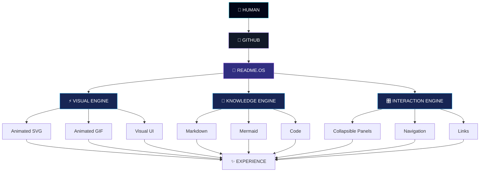
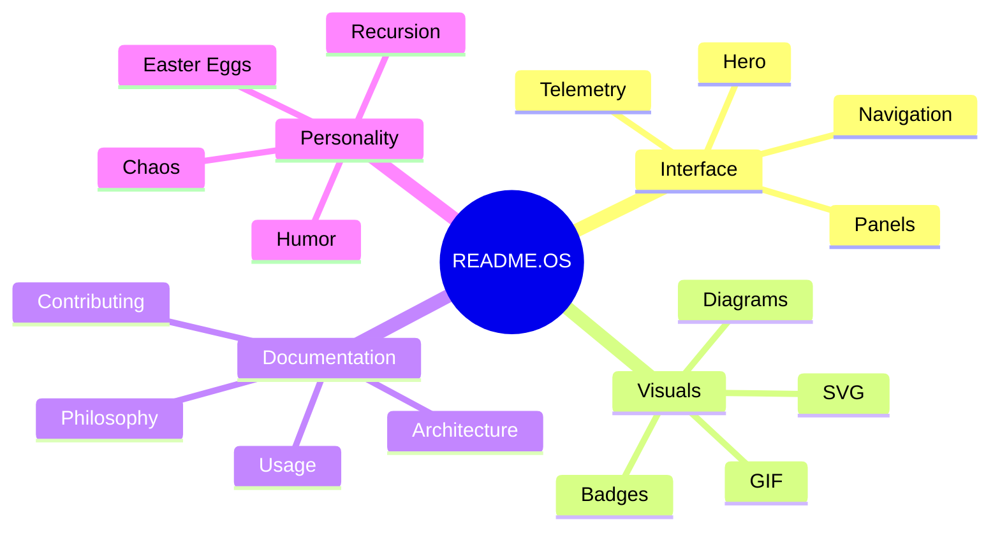
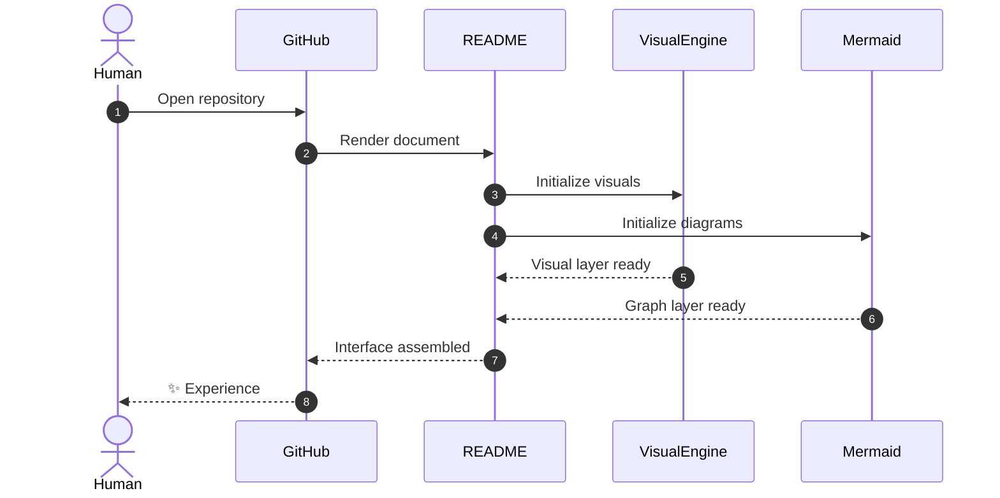
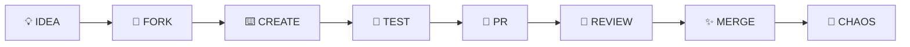

<div align="center">

<!-- ═══════════════════════════════════════════════════════════════ -->

<!--                         HERO / BOOT                            -->

<!-- ═══════════════════════════════════════════════════════════════ -->

<a href="#">

</a>

<br>


<br><br>


<br><br>

### `A README THAT DOESN'T LOOK LIKE A README.`

<br>

<a href="#system">

</a>

</div>

---

<!-- ═══════════════════════════════════════════════════════════════ -->

<!--                       AMBIENT SPACE                           -->

<!-- ═══════════════════════════════════════════════════════════════ -->

<div align="center">


<br><br>

# `01 // SYSTEM ONLINE`


</div>

> **README.OS** is an experiment:
>
> **What happens when documentation is designed like a futuristic frontend?**

Instead of throwing text at you, this repository turns its documentation into an **experience**.

```text
                     ┌─────────────────────────────┐
                     │        README.OS             │
                     │                              │
                     │     DOCUMENTATION CORE       │
                     └──────────────┬──────────────┘
                                    │
                ┌───────────────────┼───────────────────┐
                │                   │                   │
                ▼                   ▼                   ▼
           VISUAL ENGINE       KNOWLEDGE CORE      INTERACTION
                │                   │                   │
                ▼                   ▼                   ▼
          SVG / GIF / UI        MERMAID / TEXT      DETAILS / LINKS
                │                   │                   │
                └───────────────────┼───────────────────┘
                                    ▼
                             ✦ EXPERIENCE ✦
```

---

<div align="center">


# `02 // THE INTERFACE`

### **EVERYTHING YOU SEE IS PART OF THE UI.**

</div>

<table>
<tr>
<td width="33%" align="center">

## ◈

### VISUAL

Animated visuals create the environment.

`01`

</td>

<td width="33%" align="center">

## ⚡

### MOTION

The page constantly feels alive.

`02`

</td>

<td width="33%" align="center">

## 🧠

### INTELLIGENCE

The README explains itself.

`03`

</td>
</tr>
</table>

<br>

<div align="center">

```text
╭────────────────────────────────────────────────────────────────────────╮
│                                                                        │
│                     ◉ README.OS CORE                                  │
│                                                                        │
│   ┌──────────┐       ┌──────────┐       ┌──────────┐                 │
│   │  VISUAL  │──────▶│  ENGINE  │──────▶│ EXPERIENCE│                 │
│   └──────────┘       └──────────┘       └──────────┘                 │
│        ▲                   │                    │                      │
│        │                   ▼                    ▼                      │
│   ┌──────────┐       ┌──────────┐       ┌──────────┐                 │
│   │  HUMAN   │◀──────│  README  │◀──────│  SYSTEM  │                 │
│   └──────────┘       └──────────┘       └──────────┘                 │
│                                                                        │
╰────────────────────────────────────────────────────────────────────────╯
```

</div>

---

# `03 // SYSTEM TELEMETRY`

<div align="center">


```text
┌──────────────────────────────────────────────────────────────────────┐
│                         SYSTEM TELEMETRY                             │
├──────────────────────────────────────────────────────────────────────┤
│                                                                      │
│  CORE                 ████████████████████████████████  100%        │
│  VISUAL ENGINE        ████████████████████████████████  100%        │
│  DOCUMENTATION        ████████████████████████████████  100%        │
│  CREATIVITY           ████████████████████████████████  100%        │
│  CHAOS                ███████████████████████████░░░░░   91%        │
│  BORING               ░░░░░░░░░░░░░░░░░░░░░░░░░░░░░░    0%        │
│                                                                      │
│  CPU                  OPTIMAL                                       │
│  MEMORY               STABLE                                        │
│  LATENCY              ~0ms                                          │
│  DEPENDENCIES         0                                              │
│  UPTIME               ∞                                              │
│                                                                      │
└──────────────────────────────────────────────────────────────────────┘
```

</div>

<sub><b>Telemetry is simulated. The README has not actually acquired root access.</b></sub>

---

<div align="center">

# `04 // VISUAL CORE`

### **THE PAGE IS THE CANVAS.**


<br>


</div>

---

# `05 // ARCHITECTURE`



---

<div align="center">

# `06 // CORE MODULES`

</div>

<table>
<tr>

<td width="50%">

### `01` — ⚡ VISUAL ENGINE

The visual layer transforms a plain repository into something that feels closer to a product launch page.

```text
SVG
GIF
BADGES
DIAGRAMS
TYPOGRAPHY
```

</td>

<td width="50%">

### `02` — 🧠 KNOWLEDGE CORE

Information remains readable underneath all the visual chaos.

```text
DOCUMENTATION
ARCHITECTURE
EXPLANATIONS
CODE
GUIDES
```

</td>

</tr>

<tr>

<td>

### `03` — 🎛️ INTERACTION

GitHub-native interaction creates expandable interfaces without JavaScript.

```text
<details>
MERMAID
LINKS
NAVIGATION
```

</td>

<td>

### `04` — 🌀 RECURSION

The README documents itself.

Which means this documentation is simultaneously:

```text
SUBJECT
INTERFACE
DOCUMENTATION
EXPERIMENT
```

</td>

</tr>
</table>

---

# `07 // COMMAND CENTER`

<details>
<summary><b>⚡ OPEN COMMAND CENTER</b></summary>

<br>

```console
┌──────────────────────────────────────────────────────────────┐
│ README.OS COMMAND TERMINAL                                  │
└──────────────────────────────────────────────────────────────┘

$ systemctl status readme

● readme.service
   Loaded: YES
   Active: RUNNING
   Uptime: ∞

$ readme --version

README.OS v∞

$ readme --mode

ULTRA

$ readme --dependencies

0

$ readme --purpose

Turn documentation into an experience.

$ readme --exit

ERROR: EXIT NOT FOUND
```

</details>

---

# `08 // KNOWLEDGE GRAPH`

<div align="center">



</div>

---

# `09 // DEEP SYSTEM SCAN`

<details>
<summary>🔍 <b>RUN DEEP SCAN</b></summary>

```text
INITIALIZING DEEP SCAN...

[01] README KERNEL ............... FOUND
[02] VISUAL ENGINE ............... FOUND
[03] INTERACTION LAYER ........... FOUND
[04] DOCUMENTATION CORE .......... FOUND
[05] EASTER EGG SYSTEM ........... FOUND
[06] BORING COMPONENTS ........... NOT FOUND

────────────────────────────────────────

RESULT

Architecture .............. HEALTHY
Documentation ............. HEALTHY
Visual system ............. OVERCLOCKED
Self-awareness ............ QUESTIONABLE
Chaos ..................... EXTREME

SCAN COMPLETE.
```

</details>

<details>
<summary>🧬 <b>VIEW INTERNAL STRUCTURE</b></summary>

```text
README.OS
│
├── CORE
│   ├── Documentation
│   ├── Architecture
│   └── Philosophy
│
├── VISUAL
│   ├── Hero
│   ├── Animation
│   ├── SVG
│   └── Diagrams
│
├── INTERACTION
│   ├── Details
│   ├── Navigation
│   └── Links
│
└── CHAOS
    ├── Easter Eggs
    ├── Recursion
    └── Questionable Decisions
```

</details>

---

<div align="center">


# `10 // DATA FLOW`



</div>

---

# `11 // INTERACTION LAB`

<details>
<summary>🌌 <b>ORBITAL SYSTEM</b></summary>

<div align="center">

```text
                         ·       ✦
                 ✦              ·
                              .        ✧

             ·         ╭──────────────╮
                       │   README     │
          ✧            │      ◉       │
                       ╰──────────────╯
                  ·       ╲   │   ╱
                           ╲  │  ╱
                 ✦          ╲ │ ╱
                              ●
                 ·           /│\
                            / │ \
                    ✧      /  │  \

                         DOCUMENTATION
```

</div>

</details>

<details>
<summary>🛰️ <b>MISSION CONTROL</b></summary>

```text
MISSION       : REDEFINE README
OBJECTIVE     : MAXIMUM EXPERIENCE
POWER         : UNLIMITED
CREW          : YOU
NAVIGATION    : SCROLL
DESTINATION   : THE BOTTOM
```

</details>

<details>
<summary>🛸 <b>UNKNOWN SIGNAL</b></summary>

```text
SIGNAL RECEIVED...

01010010 01000101 01000001 01000100 01001101 01000101

DECODING...

"README"

Of course.
```

</details>

---

# `12 // FEATURE MATRIX`

<div align="center">

| MODULE                |    STATUS   |        POWER |
| :-------------------- | :---------: | -----------: |
| ⚡ Visual Engine       |  🟢 ONLINE  | `██████████` |
| 🧠 Knowledge Core     |  🟢 ONLINE  | `██████████` |
| 🎛️ Interaction       |  🟢 ONLINE  | `█████████░` |
| 📊 Data Visualization |  🟢 ONLINE  | `██████████` |
| 🌀 Recursion          | 🟢 UNSTABLE | `██████████` |
| 🥚 Easter Eggs        |  🟢 ACTIVE  | `██████████` |
| 😴 Boring Mode        |  🔴 OFFLINE | `░░░░░░░░░░` |

</div>

---

# `13 // PHILOSOPHY`

<div align="center">

## **DOCUMENTATION SHOULD CREATE CURIOSITY.**

<br>

```text
Traditional README

TITLE
  ↓
TEXT
  ↓
TEXT
  ↓
TEXT
  ↓
DONE


README.OS

       ✦ VISUAL
          ↓
     ⚡ INTERFACE
          ↓
     🧠 KNOWLEDGE
          ↓
     🎛️ INTERACTION
          ↓
       🌌 EXPERIENCE
          ↓
        CURIOUS?
          ↓
        EXPLORE.
```

</div>

---

# `14 // PERFORMANCE`

```text
┌────────────────────────────────────────────────────────────┐
│ PERFORMANCE PROFILE                                        │
├────────────────────────────────────────────────────────────┤
│                                                            │
│ Build process              NONE                            │
│ Backend                    NONE                            │
│ Database                   NONE                            │
│ Dependencies               0                               │
│ Installation               0 seconds                       │
│ Documentation              YES                             │
│ Visual impact              ████████████████████            │
│                                                            │
└────────────────────────────────────────────────────────────┘
```

---

# `15 // CONTRIBUTION PROTOCOL`



### Accepted contributions

```text
✓ Better visual systems
✓ Better accessibility
✓ Better animations
✓ Better documentation
✓ Creative interfaces
✓ New experiments
✓ Completely unreasonable ideas
```

### Rejected contributions

```text
✗ Boring
✗ Unnecessary complexity
✗ 900MB node_modules
✗ Removing personality
```

---

# `16 // EASTER EGG VAULT`

<details>
<summary>🔐 LEVEL 01 — CLASSIFIED</summary>

```text
You clicked.

The system noticed.

Awareness +1
```

</details>

<details>
<summary>🔐 LEVEL 02 — HIGHLY CLASSIFIED</summary>

```text
README AWARENESS:
████████████████████████████████ 100%

USER CURIOSITY:
████████████████████████████████ 100%

ESCAPE POSSIBILITY:
░░░░░░░░░░░░░░░░░░░░ 0%
```

</details>

<details>
<summary>🔐 LEVEL 03 — DO NOT OPEN</summary>

```text
╔══════════════════════════════════════╗
║                                      ║
║       YOU HAVE REACHED THE           ║
║        README SINGULARITY             ║
║                                      ║
║       THERE IS NO README BEYOND       ║
║              THIS POINT.             ║
║                                      ║
╚══════════════════════════════════════╝
```

</details>

---

<div align="center">

# `17 // SYSTEM PHILOSOPHY`

<br>


<br><br>

```text
                    ┌─────────────────────┐
                    │                     │
                    │     README.OS       │
                    │                     │
                    │   documentation     │
                    │          ×          │
                    │     interface       │
                    │          ×          │
                    │     experience      │
                    │                     │
                    └─────────────────────┘
```

</div>

---

# `18 // FINAL TRANSMISSION`

<div align="center">


<br><br>

<details>
<summary>☠️ <b>ABSOLUTELY LAST THING</b></summary>

<br>

```text
You expected:

README.md

You received:

┌───────────────────────────────┐
│                               │
│       README.OS               │
│                               │
│   Documentation               │
│          +                    │
│   Interface                   │
│          +                    │
│   Animation                   │
│          +                    │
│   Personality                 │
│          +                    │
│   Chaos                       │
│                               │
└───────────────────────────────┘
```

<br>

### The README was never the documentation.

### **The README was the experience.**

</details>

<br><br>


<br>

### `README.OS // v∞`

`SYSTEM ONLINE` · `BOREDOM 0%` · `CHAOS ∞`

<br>

<sub>Designed to make a GitHub README feel less like documentation and more like a launch experience.</sub>

</div>
